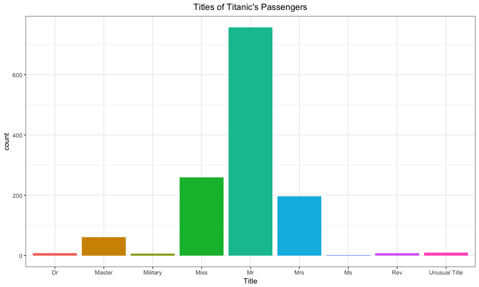
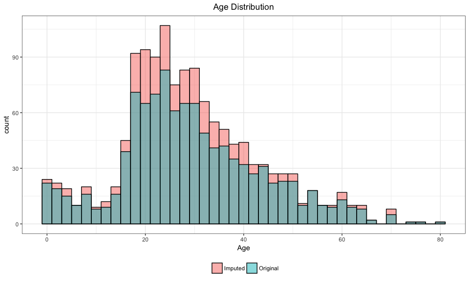
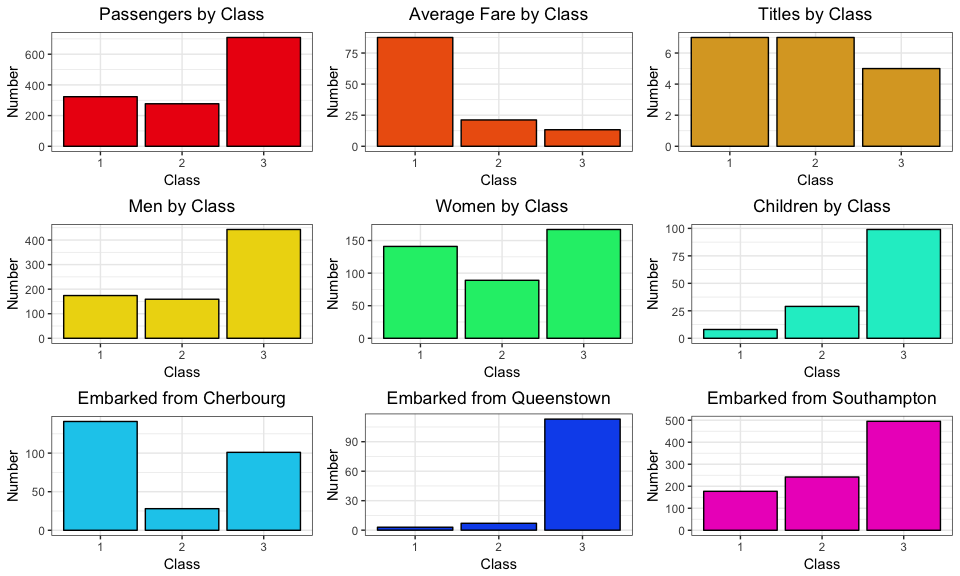
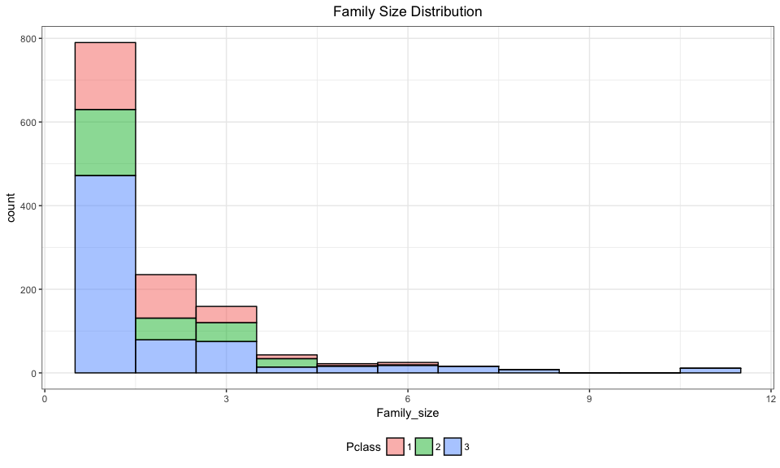
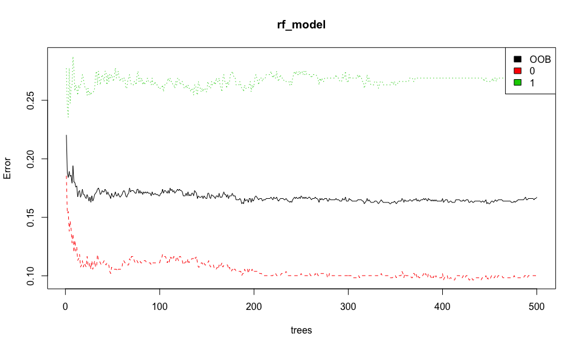
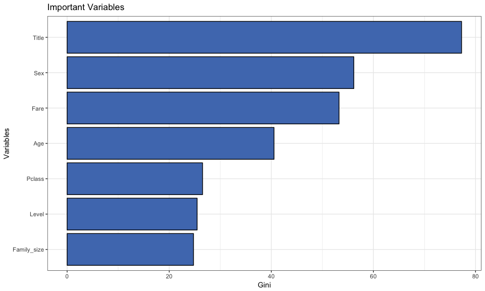

# Exploring Titanic Data
Auren Ferguson  
02 January 2017  


# Introduction
This document explores Titanic data and finds the most important factors that influenced if a person survived or not. The data can be downloaded from <https://www.kaggle.com/c/titanic/data>.

# Loading in Libraries and Data
Firstly, we load in the libraries.

```r
library(dplyr)
library(ggplot2)
library(data.table)
library(mice)
library(randomForest)
library(gridExtra)
library(stringr)
```

Then the data is loaded in. There are two files, a train and test set. Since we will be doing some EDA and feature engineering it is easier to combine them into one data set but set a training and test flag so splitting up later on will be easier.


```r
train <- as.tbl(fread(input = "./data/train.csv", na.strings = c("", " ")))
test <- as.tbl(fread(input = "./data/test.csv", na.strings = c("", " ")))
comb <- bind_rows("train" = train, "test" = test, .id = "originates")
```

# Basic EDA
Firstly, lets look at the data:


```r
comb
```

```
## # A tibble: 1,309 × 13
##    originates PassengerId Survived Pclass
##         <chr>       <int>    <int>  <int>
## 1       train           1        0      3
## 2       train           2        1      1
## 3       train           3        1      3
## 4       train           4        1      1
## 5       train           5        0      3
## 6       train           6        0      3
## 7       train           7        0      1
## 8       train           8        0      3
## 9       train           9        1      3
## 10      train          10        1      2
## # ... with 1,299 more rows, and 9 more variables: Name <chr>, Sex <chr>,
## #   Age <dbl>, SibSp <int>, Parch <int>, Ticket <chr>, Fare <dbl>,
## #   Cabin <chr>, Embarked <chr>
```

Then get some basic stats:


```r
str(comb)
```

```
## Classes 'tbl_df', 'tbl' and 'data.frame':	1309 obs. of  13 variables:
##  $ originates : chr  "train" "train" "train" "train" ...
##  $ PassengerId: int  1 2 3 4 5 6 7 8 9 10 ...
##  $ Survived   : int  0 1 1 1 0 0 0 0 1 1 ...
##  $ Pclass     : int  3 1 3 1 3 3 1 3 3 2 ...
##  $ Name       : chr  "Braund, Mr. Owen Harris" "Cumings, Mrs. John Bradley (Florence Briggs Thayer)" "Heikkinen, Miss. Laina" "Futrelle, Mrs. Jacques Heath (Lily May Peel)" ...
##  $ Sex        : chr  "male" "female" "female" "female" ...
##  $ Age        : num  22 38 26 35 35 NA 54 2 27 14 ...
##  $ SibSp      : int  1 1 0 1 0 0 0 3 0 1 ...
##  $ Parch      : int  0 0 0 0 0 0 0 1 2 0 ...
##  $ Ticket     : chr  "A/5 21171" "PC 17599" "STON/O2. 3101282" "113803" ...
##  $ Fare       : num  7.25 71.28 7.92 53.1 8.05 ...
##  $ Cabin      : chr  NA "C85" NA "C123" ...
##  $ Embarked   : chr  "S" "C" "S" "S" ...
```

```r
summary(comb)
```

```
##   originates         PassengerId      Survived          Pclass     
##  Length:1309        Min.   :   1   Min.   :0.0000   Min.   :1.000  
##  Class :character   1st Qu.: 328   1st Qu.:0.0000   1st Qu.:2.000  
##  Mode  :character   Median : 655   Median :0.0000   Median :3.000  
##                     Mean   : 655   Mean   :0.3838   Mean   :2.295  
##                     3rd Qu.: 982   3rd Qu.:1.0000   3rd Qu.:3.000  
##                     Max.   :1309   Max.   :1.0000   Max.   :3.000  
##                                    NA's   :418                     
##      Name               Sex                 Age            SibSp       
##  Length:1309        Length:1309        Min.   : 0.17   Min.   :0.0000  
##  Class :character   Class :character   1st Qu.:21.00   1st Qu.:0.0000  
##  Mode  :character   Mode  :character   Median :28.00   Median :0.0000  
##                                        Mean   :29.88   Mean   :0.4989  
##                                        3rd Qu.:39.00   3rd Qu.:1.0000  
##                                        Max.   :80.00   Max.   :8.0000  
##                                        NA's   :263                     
##      Parch          Ticket               Fare            Cabin          
##  Min.   :0.000   Length:1309        Min.   :  0.000   Length:1309       
##  1st Qu.:0.000   Class :character   1st Qu.:  7.896   Class :character  
##  Median :0.000   Mode  :character   Median : 14.454   Mode  :character  
##  Mean   :0.385                      Mean   : 33.295                     
##  3rd Qu.:0.000                      3rd Qu.: 31.275                     
##  Max.   :9.000                      Max.   :512.329                     
##                                     NA's   :1                           
##    Embarked        
##  Length:1309       
##  Class :character  
##  Mode  :character  
##                    
##                    
##                    
## 
```

It is also useful to see how many unique values and `NA` each variable has.


```r
sapply(comb, function (x) {length(unique(x))})
```

```
##  originates PassengerId    Survived      Pclass        Name         Sex 
##           2        1309           3           3        1307           2 
##         Age       SibSp       Parch      Ticket        Fare       Cabin 
##          99           7           8         929         282         187 
##    Embarked 
##           4
```

```r
sapply(comb, function(x) {sum(is.na(x))})
```

```
##  originates PassengerId    Survived      Pclass        Name         Sex 
##           0           0         418           0           0           0 
##         Age       SibSp       Parch      Ticket        Fare       Cabin 
##         263           0           0           0           1        1014 
##    Embarked 
##           2
```

There are lots of `Na` in `Survived`, this is due to the test data not having any `Survived` data. There are lots of missing values in `Age`, this is addressed below. There is also very little `Cabin` information but there isn't much that can be done about that, again see below.

# Passenger Titles
We have the names of all the passengers on board, we can extract their titles as it could be a good feature to determine who survived or not.


```r
comb$Title <- gsub('(.*, )|(\\..*)', '', comb$Name)
table(comb$Title)
```

```
## 
##         Capt          Col          Don         Dona           Dr 
##            1            4            1            1            8 
##     Jonkheer         Lady        Major       Master         Miss 
##            1            1            2           61          260 
##         Mlle          Mme           Mr          Mrs           Ms 
##            2            1          757          197            2 
##          Rev          Sir the Countess 
##            8            1            1
```

There are some very interesting titles here, such as: `Jonkheer` and `the Countess`. There are also some military titles. We can reduce the number of titles by combining some of them.


```r
military_titles <- c("Major", "Col", "Capt")
unusual_titles <- c("Don", "Sir", "Mme", "Lady", "Mlle", "the Countess", "Jonkheer", "Dona")

comb$Title <- ifelse(comb$Title %in% military_titles, "Military",
                         ifelse(comb$Title %in% unusual_titles, "Unusual Title", comb$Title))
```

<!-- -->

# Age
As we seen above, there are a lot `NA`'s in the `Age` column. We are going to use the `mice` package to use a random forest algorithm to impute the missing `Age` values in a smarter way than just median imputation.


```r
factor_vars <- c("Pclass", "Sex", "Ticket", "Cabin", "Embarked", "Title")

comb[factor_vars] <- lapply(comb[factor_vars], as.factor)

mice_imputation_df <- comb[, !colnames(comb) %in% c('Name','Ticket','Cabin','Family','Surname','Survived', 'originates')]

mice_imputation <- mice(data = mice_imputation_df, method='rf') 

output <- complete(mice_imputation)
```


```
## Warning: Removed 263 rows containing non-finite values (stat_bin).
```

<!-- -->

The imputation hasn't changed the `Age` distribution, so we will use this for imputing the `NA` values.


```r
comb$Age <- output$Age
```

# Class Analysis
The next step is to check the effect of class, how many people stayed in each section, the price of tickets, where people boarded the ship.

We define a child as a person under the age of 16:


```r
comb$Sex <- ifelse(comb$Age < 16, "child", as.character(comb$Sex))
```


```r
class_stats <- comb %>% group_by(Pclass) %>% 
  summarise(number = n(), 
            av_fare = mean(Fare, na.rm = T),
            num_titles = length(unique(Title)),
            num_male = sum(Sex == "male"),
            num_female = sum(Sex == "female"),
            num_children = sum(Sex == "child"),
            num_Cherbourg = sum(na.omit(Embarked) == "C"),
           num_Queenstown = sum(na.omit(Embarked) == "Q"),
            num_Southampton = sum(na.omit(Embarked) == "S"))
```

<!-- -->

A lot of these results are somewhat obvious, with 3rd class passengers being the most populated group with the cheapest tickets. The majority of men and children are 3rd class passengers which probably means that they were emigrating to America for a new life. Cherbourg had the largest proportion of first class passengers while practically everyone in Queenstown (now called Cobh, Co. Cork, Ireland) were 3rd class passengers, implying that the Irish people on board were generally poor and probably emigrating.

# Getting Cabin Level the Passengers Were Staying In
While most of the `Cabin` data contains `NA`'s, it is possible to extract the level which the passengers were staying in. Maybe, the lower down you were the lower your chances of survival were?


```r
comb$Cabin<- substr(comb$Cabin,1,1)
comb <- rename(.data = comb, Level = Cabin)
comb$Level <- addNA(comb$Level)
```

# Does Having a Family Help
We will look at how many passengers were with their families.


```r
comb <- comb %>% mutate(Family_size = 1 + SibSp + Parch) %>% select(-SibSp, -Parch)
```

<!-- -->

There are lots of single people and a good few with small families, there are also some large families. We can make this variable into a factor variable with 3 levels: `single`, `small families`, `large families`.


```r
comb$Family_size <- as.factor(ifelse(comb$Family_size == 1, "single",
                      ifelse(comb$Family_size > 1 & comb$Family_size <= 4, "small family",
                             "large family")))
```

# Preparing Data for Model
We have to prepare the data for modelling.


```r
factor_vars <- c("Sex", "Level", "Survived")

comb[factor_vars] <- lapply(comb[factor_vars], as.factor)
```

# Splitting Data into Train and Test


```r
train <- comb %>% filter(originates == "train")
test <- comb %>% filter(originates == "test")
```

# Random Forest Model for Finding Most Important Variables


## Model Formula

```r
rf_formula <- as.formula(Survived ~ Pclass +
                                    Sex +
                                    Age +
                                    Fare +
                                    Level +
                                    Title +
                                    Family_size)
```

## Model

```r
rf_model <- randomForest(rf_formula,
                         data = train)
```

## Plotting error
<!-- -->

## Finding Important Variables
It's time to find the most predictive variables for `Survival`.


```r
rf_importance <- as.data.frame(importance(rf_model))
rf_importance$variables <- row.names(rf_importance)
rf_importance <- rf_importance %>% select(variables, MeanDecreaseGini) %>% arrange(desc(MeanDecreaseGini))
row.names(rf_importance) <- NULL
```

<!-- -->

It appears that `Title` is the most predictive variable, followed by `Sex`. These variables are linked so it's prob not necessary to have them both in a predictive model.

